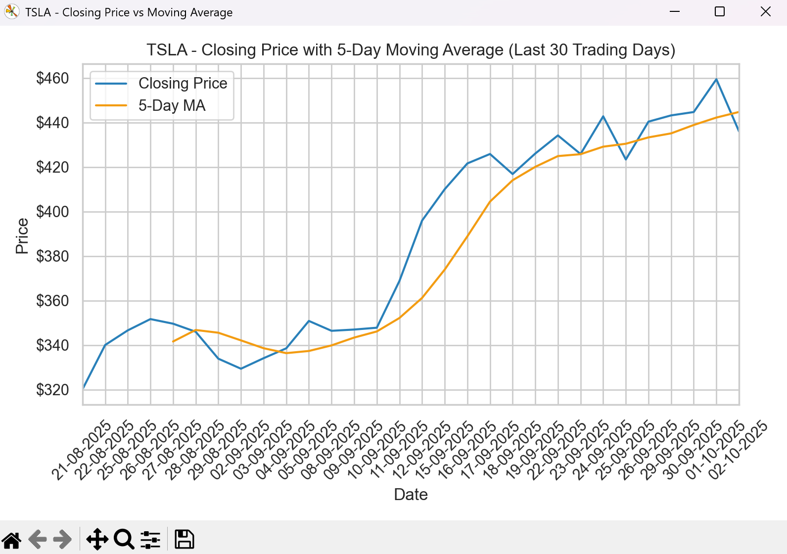
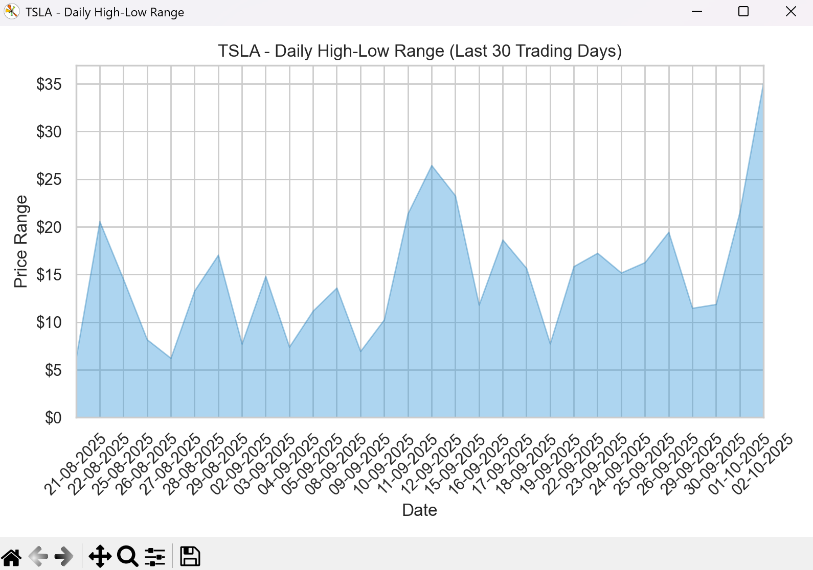
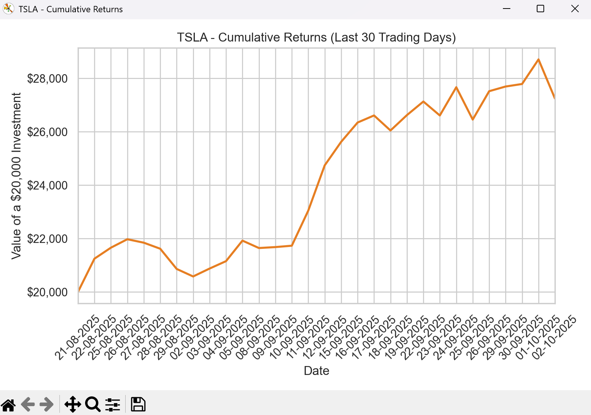
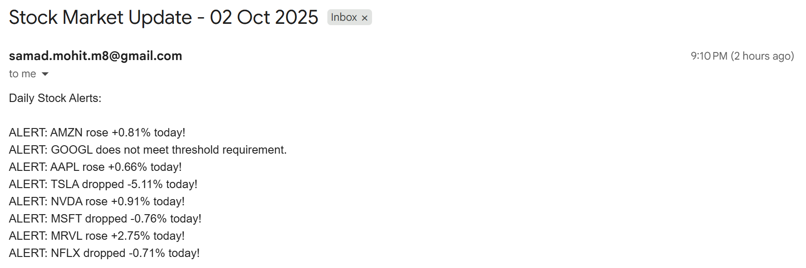

# Stock Price Tracker

A Python command-line application for tracking, analysing, and visualising stock data with optional email notifications

--- 

## ✨ Features

- Retrieves **historical stock data** while intelligently **caching results** in CSV files, minimising repeated API calls and creating a growing **local dataset** for faster future access
- Provides **live stock price updates** on demand, letting users quickly check the **current market value** of their chosen tickers
- Analyses stock **performance** over a chosen lookback period, highlighting **trends** and **key metrics**
- Produces clear and **insightful visualisations**, transforming **raw data** into **easy-to-read charts** that help uncover **market patterns**
- Supports configurable **email alerts**, allowing users to track **percentage changes** in stock prices and receive timely **notifications**, with built-in **testing** to ensure reliability across different **market conditions**

--- 

## 💻 Installation & Usage

1. Clone the repository
2. Run the following command in your terminal while in the project directory:
- `pip install -r requirements.txt`
3. Set the following environment variables on your system so the application can send email alerts:
- `EMAIL_USER` → your email address
- `EMAIL_PASS` → your email app password
4. Run the application:
- `python main.py`
5. Automate alerts with Windows Task Scheduler (optional):
    1. Open **Task Scheduler** and create a new task. Give it a descriptive name, e.g., "Stock Price Tracker Alerts"
    2. Go to the **Triggers** tab and create a new trigger:
        - Select **Daily**
        - Set the trigger time to **21:10** to allow the market data to update
    3. Go to the **Actions** tab and create a new action:
        - Select **Start a program** from the dropdown menu
        - In the **Program/Script** field, enter the full path to your Python executable
        - In the **Add arguments** field, enter:
        `run_alerts.py`
        - In the **Start in** field, enter the path to the **cloned repository's main directory**
        > ⚠️ Note: Do **not** wrap any of the paths or arguments in quotation marks
    4. (Optional) In the **Settings** tab:
        - Tick **Run task as soon as possible after a scheduled start is missed**
        - Tick **Stop the task if it runs longer than:** and select **1 hour** from the dropdown

---

## 🛠️ Technologies Used

- **Python**
- **yfinance** → retrieving live prices, historical stock data, and financial information directly from Yahoo Finance
- **pandas** → data handling, manipulation, and structured analysis
- **matplotlib** & **seaborn** → data visualisation and chart styling
- **pandas_market_calendars** → accessing and working with NYSE trading schedules

--- 

## 📖 What I Learned

- **HTTP requests** → developed an understanding of how to interact with external servers, applying it to implement a lightweight connectivity check for the application
- **JSON handling** → learnt how to structure and work with JSON data, which I used to build a configuration file for storing user-defined settings such as tickers, threshold value, and email address
- **yfinance** → became familiar with extracting live prices, historical data, and financial information through the yfinance library, making it the backbone of the project's data pipeline
- **Seaborn** → explored Seaborn to enhance the quality of visualisations, producing cleaner and more professional-looking charts alongside matplotlib
- **Email automation** → implemented functionality to send stock alerts directly to a user's inbox, gaining experience with programmatically creating and sending emails in Python
- **Task scheduling** → learnt how to schedule the script to run automatically using Windows Task Scheduler, ensuring the program operates without manual intervention

---

## 📊 Screenshots

### Closing Price vs Moving Average

### High-Low Range

### Cumulative Returns

### Email Alert Example

---

## 📌 Future Improvements

- **Push notifications** → extend the alert system to support services like Pushover, Twilio SMS, or Slack bots, providing real-time notifications beyond email
- **Database integration** → replace CSV/JSON storage with a lightweight database (e.g., SQLite or PostgreSQL) to improve scalability, reliability, and data management
- **Technical indicators** → incorporate widely used financial indicators such as RSI, MACD, and Bollinger Bands to enable more advanced trading insights

---